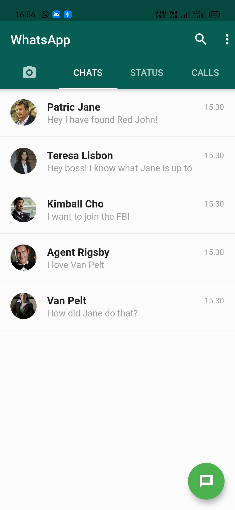

# whatsapp_ui_clone

This is a Flutter App. In this app I have created a clone of the WhatsApp User Interface. 

## Screenshots:

## TODO
1. Add 'Login' feature.
2. Add upload pictures feature.
3. Make it a fully functional chat app.
